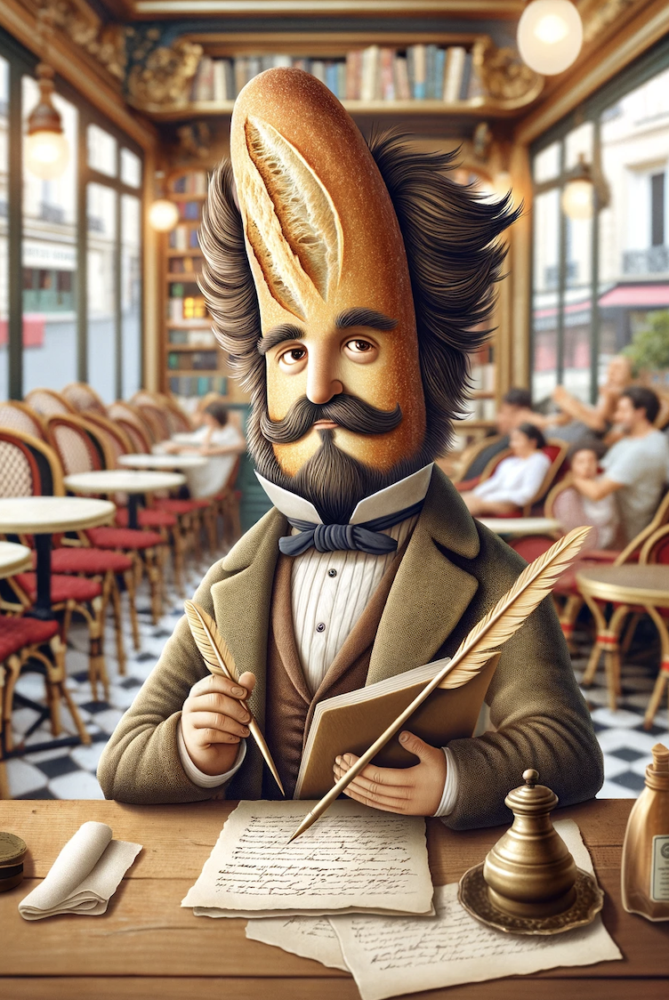

# Madame Toast's French Adventure

## 1. Why? - Our Challenge

Madame Toast, a British toaster, has always had a taste for adventure and challenge. From her London kitchen, she dreams of strolling the cobbled streets of Paris, picking up croissants, chatting to the finest macaroons and reading French classics with ease. But to do so, she has to overcome a major obstacle: learning French.

### 1.1 Context
This project was carried out as part of the ‘Data Science and Machine Learning’ course given by Professor Vlachos in the SMT master's programme. The idea for this project arose from a Kaggle competition aimed at improving foreign language learning.
The aim of the Kaggle competition was to create a model capable of predicting the difficulty of texts written in French for English speakers. The main idea is that to improve your skills in a new language, it's important to read texts that are adapted to your level. 
For Madame Toast, the problem is clear: it is often difficult to find texts that perfectly match her level of proficiency, ranging from A1 to C2. An ideal text should contain a mix of familiar and unfamiliar words, to allow for a natural and stimulating progression. 

### 1.2 Pedagogical Importance
Madame Toast has a clear pedagogical principle: free and voluntary reading. As Krashen (2004) points out, this method allows students to choose reading material that interests them personally. This encourages them to read more and acquire new words in relevant contexts.
However, Madame Toast is a new-generation toast and doesn't stop at written texts. She also loves videos. Martínez (2023) highlights the benefits of YouTube videos, including their accessibility, diversity of topics and levels of difficulty, and their ability to provide practical examples for specific skills, such as pronunciation. These resources are essential for Madame Toast, as they provide her with varied and practical opportunities to improve her French.

### 1.3 Our goal
Our goal is clear: to help Madame Toast determine the difficulty of texts so that she can read those that are adapted to her level, and to measure the progress of her comprehension by gradually confronting more complex texts. Madame Toast will meet Monsieur Baguette, the most intelligent baguette in France, who will use his innovative application to help her analyze and predict the level of French sentences. This will facilitate personalized and progressive learning, making the process of learning French more motivating.
For Madame Toast, every word she learns is a victory, every sentence she understands is another step towards mastering the language. She set off from London ready to overcome every obstacle on her way to understanding French. Her journey begins, with Paris as her final destination, where she hopes one day to converse fluently with Parisian brioches and read the works of the famous poet Victor Baguetto.

  
   
  <em>Victor Baguetto, the famous poetic baguette</em>

## How? - Our Methodology

## What? - Our Solution

## Ready to Go - Guide to Run the Code
