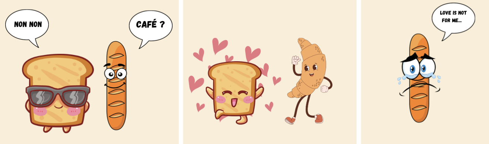

# Madame Toast's French Adventure

## 1. Why? - Our Challenge

Madame Toast, a British toast, has always had a taste for adventure and challenge. From her London kitchen, she dreams of strolling the cobbled streets of Paris, picking up croissants, chatting to the finest macaroons and reading French classics with ease. But to do so, she has to overcome a major obstacle: learning French.

### 1.1 Context
This project was carried out as part of the ‘Data Science and Machine Learning’ course given by Professor Vlachos in the SMT master's programme. The idea for this project arose from a Kaggle competition aimed at improving foreign language learning.
The aim of the Kaggle competition was to create a model capable of predicting the difficulty of texts written in French for English speakers. The main idea is that to improve your skills in a new language, it's important to read texts that are adapted to your level. 
For Madame Toast, the problem is clear: it is often difficult to find texts that perfectly match her level of proficiency, ranging from A1 to C2. An ideal text should contain a mix of familiar and unfamiliar words, to allow for a natural and stimulating progression. 

### 1.2 Pedagogical Importance 📘
Madame Toast has a clear pedagogical principle: free and voluntary reading. As Krashen (2004) points out, this method allows students to choose reading material that interests them personally. This encourages them to read more and acquire new words in relevant contexts.
However, Madame Toast is a new-generation toast and doesn't stop at written texts. She also loves videos. Martínez (2023) highlights the benefits of YouTube videos, including their accessibility, diversity of topics and levels of difficulty, and their ability to provide practical examples for specific skills, such as pronunciation. These resources are essential for Madame Toast, as they provide her with varied and practical opportunities to improve her French.

### 1.3 Our goal 🎯
Our goal is clear: to help Madame Toast determine the difficulty of texts so that she can read those that are adapted to her level, and to measure the progress of her comprehension by gradually confronting more complex texts. Madame Toast will meet Monsieur Baguette, the most intelligent baguette in France, who will use his innovative application to help her analyze and predict the level of French sentences. This will facilitate personalized and progressive learning, making the process of learning French more motivating.
For Madame Toast, every word she learns is a victory, every sentence she understands is another step towards mastering the language. She set off from London ready to overcome every obstacle on her way to understanding French. Her journey begins, with Paris as her final destination, where she hopes one day to converse fluently with Parisian brioches and read the works of the famous poet Victor Baguetto.

  
   
  <em>Victor Baguetto, the famous poetic baguette</em>

## How? - Our Methodology

### OpenAI Fine-tuning
As a final step, Mr Baguette tried model fine-tuning. This is a case of transfer learning where an existing model is trained on a specific task in order to optimise its performance. We used OpenAI models, for which you can obtain your API key and all the documentation on their dedicated platform: [OpenAI Platform](https://platform.openai.com/docs/overview)

**Fine-tuning steps**

**1. Data Preparation:** Gather and prepare the data specific to the task for which you wish to fine-tune the model. For ‘davinci 002’, the data must be organised into prompt-response pairs.

**2. Model Selection:** Choose a pre-trained base model such as ‘davinci 002’ or ‘gpt-3.5-turbo’ from the OpenAI platform.

**3. Model Training:** Use the OpenAI API to start the fine-tuning process with your prepared dataset.

**4. Evaluation and Prediction Generation:** Evaluate the performance of the fine-tuned model. Make predictions on test data. 

We found slightly lower results in terms of accuracy compared with our best Bert model, but better consistency in the results. The model that works best is ‘davinci 002’, followed by the famous ‘gpt-3.5-turbo’.

To obtain our best results, we used a temperature of 0.2 and a seed of 42 when generating the predictions. You will find a notebook to use in the document. You will of course need to enter your own API key for this to work. The notebook shows an example of fine-tuning the ‘davinci 002’ model.

**Data format**
For the ‘davinci 002’ model, the training data must be organised in JSON format with prompt-response pairs as follows:
{"prompt": "Translate the following English text to French: 'Hello, how are you?'",
  "completion": "Bonjour, comment ça va ?"}

To use the ‘gpt-3.5-turbo’ model, the data must be organised in a different format, following the structure below:
{"messages": [
    { "role": "system", "content": "You class French text on their difficulty" },
    { "role": "user", "content": "Bonjour, je suis une baguette'" },
    { "role": "assistant", "content": "A1" }
  ]}

By following these steps and using the appropriate data formats, you can, like Mr Baguette, fine-tune the OpenAI models to classify the level of French text. 

## What? - Our Solution
Now that we've found the right model for Madame Toast to overcome her major difficulty of defining the difficulty of texts, she only needs to take a few more steps before conquering Paris. When she arrived on French shores, she met Monsieur Baguette. An experienced StreamLit application developer and madly in love with Madame Toast, he decided to develop an application that would meet her needs perfectly.

The fundamental educational principles he has implemented in the application include free reading and different types of media, gamification, progress tracking and adaptation to the user's level.

The main features of Monsieur Baguette's application are as follows:

### Level assessment 🥇
Before starting to learn French, Mr Baguette first had to assess Mrs Toast's current level so that he could offer her suitable texts and videos. Eager to do the right thing, he suggests a questionnaire to assess her level.

### Article and Video Browser 📄🎬
Madame Toast can now search for articles and videos by filtering them according to the themes that interest her. This is made possible by the YouTube API for videos and the Media Stack API for articles. Monsieur Baguette's application obviously offers texts and videos that match the user's level. If Madame Toast would like to read the transcript of the video, that's also possible.

### Immediate translation 🇬🇧
If Madame Toast doesn't understand a word, she can copy and paste it into the translator in the sidebar to get an immediate translation, thanks to the Google Translate library.

### Vocabulary list 🆕
For words she wants to remember, she can add them to her vocabulary list, where she will have the definition thanks to the PyDictionary library, as well as the translation. She can also remove a word when she considers it has been learnt and track the evolution of her vocabulary.

### Feedback process 🌟
Each time Madame Toast reads a text, she can give feedback: ‘Too Easy’ , ‘Just Right’ , ‘Challenging’, 'Too Difficult' . Depending on her answers, her level gradually changes and the application recommends texts adapted to her new level. She can also consult all her statistics on a dedicated page showing her progress and the various badges she can acquire as she progresses.

These are the key features of the application that really appealed to Madame Toast. Thanks to her desire to learn and the fact that Mr Baguette's application was perfectly suited to her needs, she is no longer content to just say ‘Oui Oui’ to everything. Monsieur Baguette asked her to go for a drink on a Parisian terrace, but she replied ‘Non Non’ and went off into the arms of Monsieur Croissant, who recited Victor Baguetto's famous verses to her.

## Ready to Go - Guide to Run the Code
